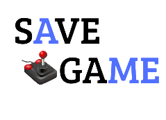

# Save-Games 💾 🕹️

  

Um app para você que quer organizar os jogos que deseja jogar ou já concluiu, além de ter uma comunidade onde pode ver reviews de jogos finalizados e criar sua própria lista de jogos de cada console, especificando a sua nota em relação ao jogo.

#### 🚧 Em Desenvolvimento

#### ⚙️ Arquitetura Backend
 A arquitetura escolhida para o projeto será a `Monolítica Modular`, por conta de ao mesmo tempo ser um pouco mais simples de implementar e detém um baixo acoplamento devido aos módulos que ficam responsáveis por cada domínio da aplicação.

#### 🏛️ Arquitetura FrontEnd

#### 🎨 Design
O design do app está sendo prototipado no Figma. 

Link do design: https://www.figma.com/design/nE9h6RPfuu3WOdWT7deRYa/Untitled?node-id=0-1&t=YRyKqLa13Zgonse1-1

#### 💻 Tecnologias

